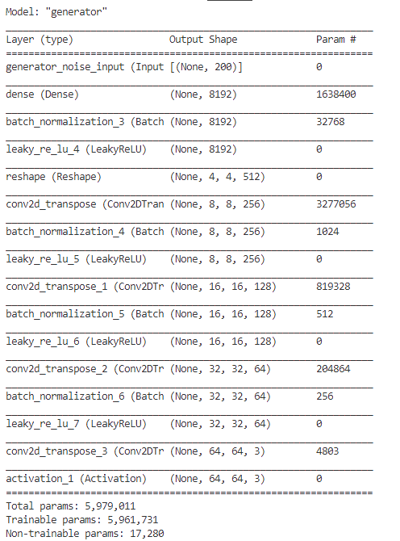
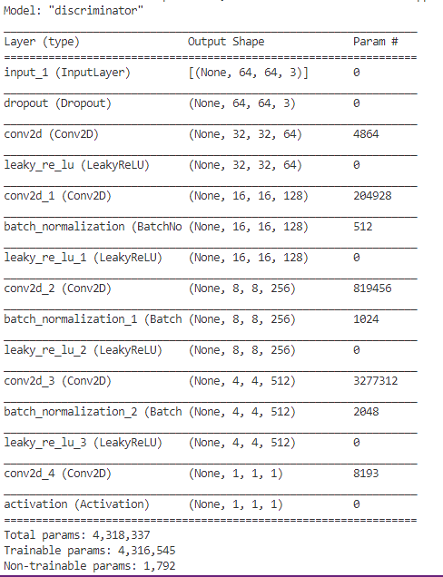
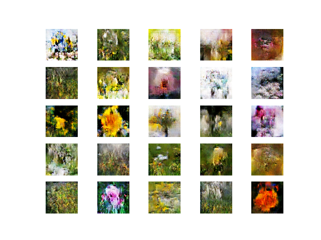
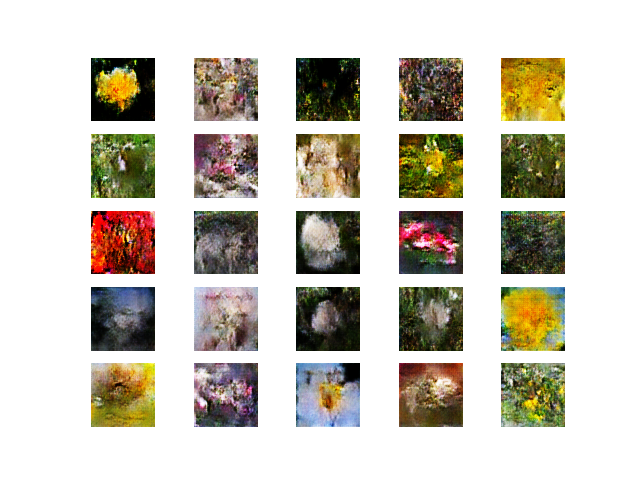

# Generative Adversarial Networks with Tfrecord files

This repository contains a TensorFlow implementation of GANs with tfrecord files for training image generation models.

## Requirements
To use this code, make sure you have the following packages installed:

- TensorFlow-gpu
- glob
- os
- pillow
- matplotlib
## Dataset 

Download the flower dataset from the TensorFlow Datasets [website](https://www.tensorflow.org/datasets/catalog/tf_flowers). Organize the dataset by collecting the images of five classes (daisy, dandelion, roses, sunflowers, tulips) into one folder.

Run the script 'Convert_jpg_to_tfrecord.py' to convert the images into a tfrecord file named 'flower.trfecord'.

## Train

To train the GAN model using the tfrecord file, execute the 'script gan_tfrecord.py'.

The trained weights will be saved in the 'saved_model/' directory.

## Directory Structure
For convenience, the tfrecord file is provided in the 'tfrecord files/' directory.

## Training Details
Number of epochs: 200
Learning rate: 0.0005

## Model Details
Below are the details of the Generator and Discriminator architectures:

  

  

## Testing
To test the trained model, set the mode argument to 'test' in the script gan_tfrecord.py, then execute the script again. The code will automatically load the pre-trained weights of the generator and generate random flower images.

Here are some generated images:

  
 

## Tensorboard
Tensorboard has been integrated into the code for further analysis. To access Tensorboard:

1: Navigate to your project directory.

2: Run python -m tensorboard.main --logdir=logs/  

3: Copy the http://localhost:6006/ in your internet browser.  

Feel free to explore and modify the code as needed. Happy training!

